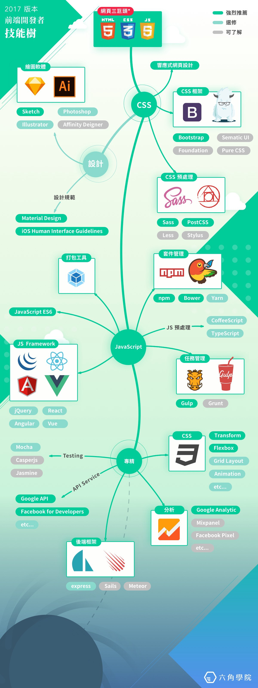

# 2017版本- 前端開發者 技能樹 --學習筆記 

*出自： [六腳學院 - 2017 前端開發者技能樹！](http://www.hexschool.com/2017/06/12/2017-06-12-skill_tree/)*

## 說明

*  **強烈推薦**
*  **選讀研修**
*  **可了解**

## 目錄

* [CSS](#CSS)
	* [CSS框架](#CSS框架)
	* [響應式網頁RWD](#響應式網頁RWD)
	* [設計](#設計)
	* [CSS預處理](#CSS預處理)
* [JavaScript](#JavaScript)
	* [打包工具](#打包工具)
	* [JavaScript ES6](#JavaScript ES6)
	* [JS Framework](#JS Framework)
	* [套件管理](#套件管理)
	* [JS預處理](#JS預處理)
	* [任務管理](#任務管理)
* [專精](#專精)
	* [CSS](#CSS)
	* [JavaScript ES6](#JavaScript ES6)
	* [JS Framework](#JS Framework)
	* [套件管理](#套件管理)
	* [JS預處理](#JS預處理)

## 原圖

## 資源整理

### 網頁三巨頭 
- HTML、JavaScript、CSS

> ### CSS 
* #### CSS框架 
	* Bootstrap  
	* Sematic UI  
	* Foundation  
	* Pure CSS  

* #### 響應式網頁RWD 		
* #### 設計 
	* 繪圖軟體 
		* Sketch 
		* Photoshop  
		* IIIustrator  
		* Affinity Deigner  
	* {設計規範}
		* Material Design  
		* iOS Huamn Interface Guidelines  

* #### CSS預處理 
	* Sass 
	* PostCSS 
	* Less  
	* Stylus  	

**[⬆ back to MENU](#目錄)**
---

> ### JavaScript 
* #### 打包工具 
		
* #### JavaScript ES6 
		
* #### JS Framework 
	* jQuery  
	* AngularJS  
	* React  
	* Vue  
	
* #### 套件管理 
	* npm 
	* Bower 
	* Yarn  		
* #### JS預處理  
	* CofeeScript  
	* TypeScript  
* #### 任務管理 
	* Gulp 
	* Grunt  
	
**[⬆ back to MENU](#目錄)**
---

> ### 專精 
* #### CSS 
	* Transform 
	* Flexbox 
	* Grid Layout  
	* Animation  
	* etc..
* #### Testing  
	* Mocha  
	* Casperjs
	* Jasmine
* #### API Serive   
	* Google API 
	* Facebook for Developers 
	* etc..
* #### 分析 
	* Google Analytic 
	* -Mixpanel  
	* -Facebook Pixel  
	* etc..
* #### 後端框架 
	* express  
	* Sails  
	* Meteor  
	
**[⬆ back to MENU](#目錄)**
---

> Icons made by Dimitry Miroliubov from www.flaticon.com is licensed by CC 3.0 BY
